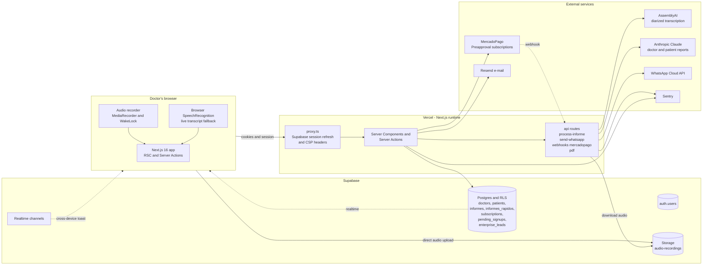
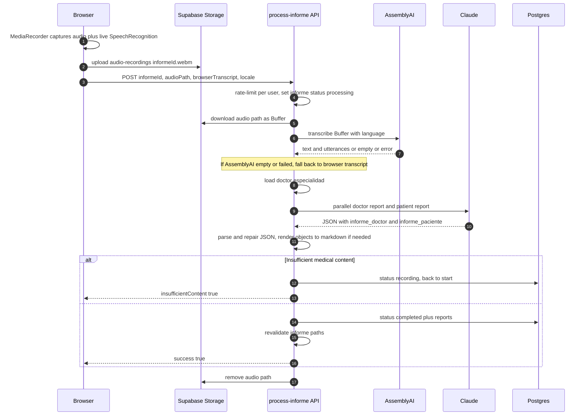
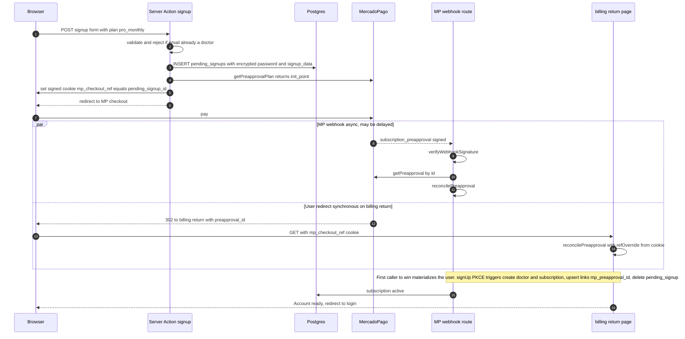

# imihealth-web

IMI Health is an AI-powered clinical documentation platform for doctors. A physician records a consultation from the browser; the audio is transcribed with diarization, an LLM generates a structured clinical note (doctor-facing) and a plain-language summary (patient-facing), and the doctor distributes the resulting PDFs via WhatsApp or e-mail in seconds. Free tier covers 10 reports; Pro tier (monthly/yearly) is sold through MercadoPago.

This document is the entry point for the codebase: what the system does, how it is built, and why the moving parts fit together the way they do.

---

## 1. Product surface

| Capability | What the doctor sees | What happens under the hood |
|---|---|---|
| **Classic informe** | Pick a patient, hit record, talk through the consultation, stop. A doctor report + patient report appear and get persisted on the patient timeline. | Audio → AssemblyAI (diarized) → Claude (specialty-aware system prompt) → two reports → DB. |
| **Informe rápido** | One-click record without choosing a patient. A doctor-only note is produced and saved in a separate, lightweight log. | Same pipeline, but persists to `informes_rapidos` and skips the patient report. |
| **Pedidos** (medical orders) | Inside an informe, the doctor selects ordered studies. We render one PDF per item. | `pdf-lib`-based PDF generation server-side, optionally pushed to WhatsApp via templated messages. |
| **Certificado** | Generates a sick-leave / medical certificate with N days off, diagnosis and observations. | Same PDF pipeline; sanitized labels and signature image embedded. |
| **WYSIWYG editing** | Markdown editor (Tiptap) for both the doctor and patient versions. | Persisted via server actions; PDFs are regenerated on demand from the latest text. |
| **Distribution** | Send to patient by WhatsApp or e-mail. | WhatsApp Cloud API (templated messages with PDF + PNG) and Resend (branded e-mail templates). |
| **Dashboard** | Counts, status breakdown, and per-month volume. | Aggregated server-side via `actions/dashboard-charts.ts`; client renders with Recharts. |

---

## 2. Tech stack

### Runtime
- **Next.js 16** (App Router, React Server Components, Server Actions). React Compiler is enabled (`next.config.ts:18`), so most components avoid manual `useMemo`/`useCallback`.
- **React 19**.
- **TypeScript 6**, **Zod 4** for runtime validation at every server-action / API boundary.
- **Tailwind v4** + **shadcn/ui** + **Radix UI** primitives.
- **next-intl** with precompiled JSON catalogs (`messages/es.json`, `messages/en.json`).

### Data & infra
- **Supabase** for Postgres, Auth (email + password, PKCE flow), Storage (audio uploads), Realtime (notifications when a quick report finishes on another device), and RLS for multi-tenant isolation.
- **Vercel** as the hosting target (serverless functions, edge middleware, Speed Insights, Analytics).

### AI & integrations
- **Anthropic Claude** (`claude-haiku-4-5`, see `src/lib/ai-model.ts`) — generates the doctor and patient reports in parallel.
- **AssemblyAI** — server-side transcription with speaker diarization (`speech_models: ["universal-3-pro", "universal-2"]`) plus the browser's native SpeechRecognition as a live-preview/fallback transcript.
- **MercadoPago** subscriptions (`/preapproval_plan` based) for Pro billing.
- **WhatsApp Cloud API** (Meta Graph API) for templated message delivery with PDF + image attachments.
- **Resend** for transactional e-mail (branded templates in `src/lib/email-template`).
- **Sentry** for error tracking — wired into the proxy, server actions, API routes, and Anthropic client.
- **pdf-lib** + **sharp** for server-side PDF generation and image rasterization (used to create both the PDF document and a PNG preview that WhatsApp displays inline).
- **Tiptap** + `tiptap-markdown` for the WYSIWYG report editor.

### Observability & quality gates
- Jest 30 + React Testing Library + jsdom; coverage gating wired through `npm run checks`.
- ESLint 10 + `eslint-config-next`.
- `react-doctor.config.json` + `tsc --noEmit` enforce typing on every commit.

### Required environment variables
The app expects (non-exhaustive):
- `NEXT_PUBLIC_SUPABASE_URL`, `NEXT_PUBLIC_SUPABASE_PUBLISHABLE_KEY`, `SUPABASE_SECRET_KEY` — Supabase clients (anon SSR + service role).
- `ANTHROPIC_API_KEY`, `ASSEMBLYAI_API_KEY`.
- `MERCADOPAGO_ACCESS_TOKEN`, `MERCADOPAGO_WEBHOOK_SECRET`, `MERCADOPAGO_PRO_MONTHLY_PLAN_ID`, `MERCADOPAGO_PRO_YEARLY_PLAN_ID`.
- `WHATSAPP_*` (Cloud API token, phone number id), `RESEND_API_KEY`.
- `NEXT_PUBLIC_APP_URL`, `FREE_PLAN_MAX_INFORMES` (default 10), `SIGNUP_PASSWORD_KEY` (used to encrypt the staged password while the user is on MP checkout), `CHECKOUT_REF_COOKIE_SECRET`.
- `RECAPTCHA_*` for the public landing forms.

---

## 3. High-level architecture



### Why this shape
- **Server-first**: every page is a Server Component. The browser never holds Supabase service-role keys, never calls Anthropic directly, and never sees raw transcripts before they are persisted. The CSP locked down in `src/proxy.ts` enforces this (the only outbound origins permitted from the client are Supabase, AssemblyAI for direct streams if we ever need them, and the Sentry tunnel).
- **Direct-to-storage uploads**: the recorded audio blob is uploaded straight from the browser to Supabase Storage (`audio-recordings`). The `/api/process-informe` route receives only the storage path, which keeps payloads under Vercel's 4.5 MB serverless body limit (a real bug we hit on 30-minute consultations). The route deletes the audio in `finally` so the bucket stays clean and the data is never persisted long-term.
- **Cookie-aware Supabase clients everywhere**: `src/utils/supabase/server.ts` exposes `createClient` (anon, scoped to the user's cookies → respects RLS) and `createServiceClient` (service role, used only in webhook handlers and reconcilers). The proxy refreshes the session cookie on every request before any other code runs.
- **MercadoPago is the source of truth for billing**, not our DB. `src/lib/billing/reconcile.ts` only ever derives state from the latest `getPreapproval()` payload, which makes webhook retries and out-of-order delivery safe by construction.

---

## 4. Core flows

### 4.1 Audio → report (the hot path)



Notable design choices:
- **Two transcript sources**. The browser's `SpeechRecognition` gives the doctor a live preview during the recording and acts as a fallback if AssemblyAI fails. The server prefers AssemblyAI when it returns a non-empty result.
- **Specialty-aware prompts**. `src/lib/prompts/index.ts` has 40+ specialty system prompts (cardiología, traumatología, psiquiatría…). `getSpecialtyPrompt(doctor.especialidad)` chooses one; we fall back to a generic prompt if the doctor's specialty isn't mapped.
- **Hardened JSON parsing**. The model is instructed to return `{"valid_medical_content": ..., "informe_doctor": "..."}`, but it occasionally returns an unwrapped clinical structure or truncates. `parseDoctorResponse` has three layers: (1) strict JSON parse, (2) string-aware extractor that tolerates truncation, (3) markdown rendering of an unexpected object shape so the doctor still gets a usable report.
- **Wake Lock**. The recorder requests `screen` wake lock and re-acquires it on `visibilitychange` and every 20 s — iOS Safari silently releases it without firing the release event.

### 4.2 Quick informe (informe rápido)

A streamlined variant exposed at `/quick-informe`. Same audio + AI pipeline, but writes to `informes_rapidos` (no patient FK, no patient report). It uses Realtime to push a toast to the doctor's other devices when processing finishes, so they can keep working while the report cooks. Implemented via `processQuickInforme` server action and `informes_rapidos_doctor_id_created_at_idx` for the doctor's list.

### 4.3 Auth & multi-tenant isolation

- **Email + password** with **PKCE flow** (`?code=…` link in confirmation e-mails, handled by `/auth/confirm`). Switching to PKCE was deliberate — the implicit flow returns tokens as URL fragments which never reach our server route.
- **DB triggers** auto-provision tenant rows. On `INSERT INTO auth.users` we run two triggers:
  - `on_auth_user_created` → creates a `doctors` row from `raw_user_meta_data` (name, dni, matricula, phone, especialidad).
  - `on_auth_user_created_subscription` → inserts a `free` `active` subscription row.
  This means any code path that calls `supabase.auth.signUp()` ends up with a fully-formed tenant; reconcilers only need to update, never bootstrap.
- **RLS everywhere**. Every domain table (`doctors`, `patients`, `informes`, `informes_rapidos`, `subscriptions`, `pending_signups`) has `ALTER TABLE … ENABLE ROW LEVEL SECURITY` and policies of the form `USING (doctor_id = (SELECT auth.uid()))`. The only writes that bypass RLS are webhook handlers using the service-role key (clearly named `createServiceClient` and confined to `src/utils/supabase/server.ts`).
- **Proxy** (`src/proxy.ts`) refreshes the Supabase session on every request, sets the Sentry user context, and applies the CSP header. Public paths (`/home`, `/login`, `/signup`, `/pricing`, `/api/webhooks`, `/api/send-email`, `/auth/*`) are exempt; everything else redirects unauthenticated traffic to `/home`.

### 4.4 Billing — Pro signup with deferred materialization



Why this shape:
- **No real account exists until payment is authorized.** Free signups create the user up-front; Pro signups stage to `pending_signups` (password encrypted at rest with `SIGNUP_PASSWORD_KEY`) and only call `auth.signUp()` after MP confirms. A doctor who abandons checkout never gets an `auth.users` row, never receives a confirmation e-mail, and never counts against the doctors table.
- **Two reconcile callers, one shared function.** Plan-based MP checkout strips the `external_reference`, which is why we stash the `pending_signups.id` in a signed cookie and `/billing/return` reads it back. The webhook is then a backup for async events (cancellations from the MP portal, recurring charges, signature replays). Both call into `reconcilePreapproval` and converge to the same end state.
- **Concurrent calls are safe.** Both paths call `auth.signUp()` with the same email, but `auth.users.email` is unique, so the loser throws `already registered`. The webhook returns a 500 (MP retries), and `/billing/return` falls back to the polling component (`SignupStatusPoller`) reading `/api/billing/signup-status`.
- **Stale-cancellation guard.** When a doctor switches plans (monthly → yearly), MP cancels the old preapproval and emits a `cancelled` event. Without a guard, the late webhook would flip the doctor back to cancelled. We compare `mp_preapproval_id` on the row vs. the event and ignore the stale one.

### 4.5 Distribution (WhatsApp + e-mail)

`/api/send-whatsapp/route.ts` is the single send endpoint, dispatching on `type` ∈ {`informe`, `certificado`, `pedidos`, `pedidos-patient`}.
- Generates the PDF (and a PNG preview for inline display) server-side from the latest DB content + doctor signature.
- Uploads each artifact to WhatsApp's media endpoint, then sends a templated message — Meta requires pre-approved templates, so we maintain `getDocTemplateName` / `getImgTemplateName` lookups keyed on locale.
- Rate-limited to 15 sends/min/user.

E-mail uses Resend with branded templates in `src/lib/email-template`, including `escape.ts` (XSS hardening) and a shared `branded-email.ts` chrome.

---

## 5. Data model (current)

```
auth.users (Supabase)
    │  trigger on insert
    ├──► doctors                  (one-to-one: id = auth.users.id)
    │       name, dni, matricula, phone, especialidad,
    │       tagline, firma_digital, avatar
    │
    ├──► subscriptions            (one-to-one)
    │       plan ∈ free | pro_monthly | pro_yearly
    │       status ∈ active | cancelled | past_due | pending
    │       mp_preapproval_id, mp_payer_id, current_period_*
    │
    └──► pending_signups          (zero-or-one, transient — deleted on materialize)
            email, encrypted_password, signup_data (JSONB)

doctors  ──┬──► patients          (many)
           │       name, dni, dob, phone, email,
           │       obra_social, nro_afiliado, plan
           │
           ├──► informes          (many; tied to a patient, optional)
           │       status ∈ recording | processing | completed | error
           │       informe_doctor, informe_paciente,
           │       recording_duration
           │
           └──► informes_rapidos  (many; no patient FK)
                   status ∈ processing | completed | error
                   transcript, informe_doctor, error_message

(public, anon-insert only)
enterprise_leads     company_name, contact_name, email, phone, notes
```

Realtime is enabled on `informes` and `informes_rapidos` so a doctor recording on one device gets a toast on others when the report finishes.

---

## 6. Plan limits and read-only mode

`src/lib/free-plan-limits.ts` exposes `FREE_PLAN_LIMITS.MAX_INFORMES` (10 by default, env-overridable). `getPlanInfo()` (server action) computes:

- `isPro` — plan ∈ {pro_monthly, pro_yearly} and status ∈ {active, pending}.
- `isReadOnly` — Pro that has been cancelled past `current_period_end`. Sign-in still works, existing data stays visible, but new informes are blocked. The UI shows `<ReadOnlyBanner />`.
- `canCreateInforme` — derived from plan + `currentInformes` count.

This is gating performed both in server actions and surfaced through the `PlanProvider` context for client components.

---

## 7. Code layout

```
src/
├── app/                    # App Router
│   ├── api/                # process-informe, send-whatsapp, send-email, pdf/*, webhooks/mercadopago, billing/signup-status
│   ├── auth/               # confirm, auth-error
│   ├── billing/return/     # MP redirect target — runs server-side reconcile
│   ├── informes/[id]/      # report view + grabar (recording) sub-route
│   ├── informes-rapidos/   # quick report list/detail
│   ├── patients/, profile/, pricing/, signup/, login/, …
│   └── page.tsx            # tabs: Informes / Mis Pacientes / Dashboard, or PublicLandingPage
├── actions/                # "use server" boundaries
│   ├── informes/           # create, process-transcript, regenerate, certificado, pedidos, queries, updates
│   ├── subscriptions/      # checkout, cancel-subscription, get-plan-info
│   ├── patients/, doctors/, dashboard-charts.ts, auth.ts, locale.ts, verify-captcha.ts
├── components/             # UI; recorder, editors, tabs, billing, pricing, signup, ui/* (shadcn)
├── lib/
│   ├── prompts/specialties # 40+ specialty system prompts
│   ├── mercadopago/        # api.ts (REST wrapper), webhook.ts (signature verification)
│   ├── billing/            # reconcile.ts, checkout-ref-cookie.ts (signed)
│   ├── pdf/, report-image/ # pdf-lib + sharp pipelines
│   ├── email-template/     # Resend HTML templates
│   ├── whatsapp/           # Cloud API client + media + templates
│   ├── transcribe.ts       # AssemblyAI client
│   ├── ai-model.ts         # ANTHROPIC_MODEL constant
│   ├── rate-limit.ts       # in-memory per-user limiter
│   └── signup-password-crypto.ts
├── schemas/                # Zod schemas (single source of truth for runtime + type inference)
├── types/                  # `z.infer<>` re-exports + non-zod types
├── utils/supabase/         # server.ts (anon + service), client.ts, middleware.ts, admin.ts
├── i18n/                   # next-intl wiring
├── proxy.ts                # Edge middleware (auth + CSP)
└── instrumentation*.ts     # Sentry init

supabase/migrations/        # timestamped SQL — table definitions, triggers, RLS policies
messages/{es,en}.json       # next-intl precompiled catalogs
scripts/setup-mp-plans.mjs  # bootstraps MercadoPago preapproval plans
```

---

## 8. Security posture

- **CSP** locked down in the proxy to `self` + Supabase + AssemblyAI + Anthropic + reCAPTCHA; `frame-ancestors 'none'`, `object-src 'none'`. HSTS preloaded at the Next.js header level.
- **RLS** is the primary tenant isolation, not application-layer checks. Service-role usage is auditable to `createServiceClient` callers.
- **Webhook signature verification** for MercadoPago (`x-signature` HMAC against `data.id` + `x-request-id` and `MERCADOPAGO_WEBHOOK_SECRET`). Invalid signatures get a 401 immediately.
- **Idempotency keys** on every MP `POST /preapproval_plan` and `POST /preapproval`.
- **Rate limits** per user on `/api/process-informe` (10/min) and `/api/send-whatsapp` (15/min).
- **Encrypted-at-rest password** in `pending_signups` until the user materializes; row is deleted as part of materialization.
- **Audio is transient**: uploaded to a short-lived path in Supabase Storage and removed in `finally` after processing.
- **Sentry user scoping** in the proxy — every captured exception is tied to the authenticated user.

---

## 9. Running locally

```bash
npm install
cp .env.example .env       # fill in the env vars listed above
npm run dev                # next dev on PORT=3002
```

Useful scripts:

```bash
npm run lint               # eslint
npm run type-check         # tsc --noEmit
npm test                   # jest
npm run test:coverage
npm run build              # next build (Sentry source maps upload in CI)
npm run checks             # the full gate: lint + type + test + build
npm run setup:mp-plans     # one-shot: creates the MP preapproval plans
```

The Supabase project is provisioned via the `supabase/migrations/*.sql` files, applied through the Supabase CLI (`supabase db push`) or the dashboard SQL editor.

---

## 10. What to know if you're poking the codebase

- **Server actions are `"use server"` files**, never inline in components. Re-exports live in `src/actions/<domain>.ts`; the implementations live in `src/actions/<domain>/<verb>.ts`.
- **All inputs are Zod-validated** at the action/API boundary using the schemas in `src/schemas/*`. Types are derived from schemas (`z.infer`), so changing the contract changes both validator and TypeScript at once.
- **RSC > client components**. Drop a component in `app/` and prefer keeping it server-side; use `"use client"` only for interactive bits (recorder, editors, dialogs, charts).
- **Don't introduce new Supabase clients ad hoc** — go through `src/utils/supabase/{server,client,admin,middleware}.ts`. The `createServiceClient` is service-role and must never be imported from a `"use client"` module.
- **MP reconciliation is idempotent and ref-keyed**: `mp_preapproval_id` is the durable join key once a row is bound. Adding a new MP event type means adding a branch in `reconcilePreapproval` and the webhook router, not a parallel reconciler.
- **Adding a specialty**: add the system prompt under `src/lib/prompts/specialties/<slug>.ts`, register it in `src/lib/prompts/index.ts`, and add the literal label to `ESPECIALIDADES` in `src/schemas/auth.ts`. The map key must match the label exactly.
- **Tests** live in `src/__tests__/` (see `jest.config.ts`). The recorder, billing reconciler, and prompt parsers have the most coverage — those are the failure modes that bite.
